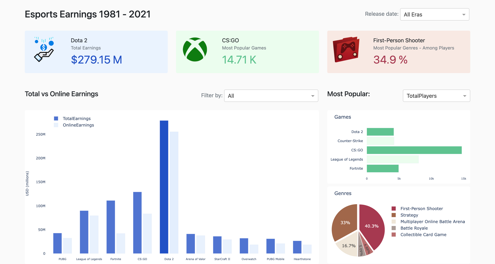

# 🎥 Esports Earnings Dashboard
Simple data visualization project that visualize the earnings of the online games on various online and offline tourments.
 
## 🤔 How to use this project

To get started just run the python script `Dashboard.py` 

NOTE: You need to have python already on your operating system

## 💁 What You're Getting
```bash
├── assets  
├────────── Images
├────────── script.js
├────────── style.css
├── Data
├── 0.Preparation.ipynb
├── 1.Plots.ipynb
├── Dashboard.ipynb
├── Dashboard.py
├── figures.py
```

### 📸 Wireframe of the Dashboard


<br/>